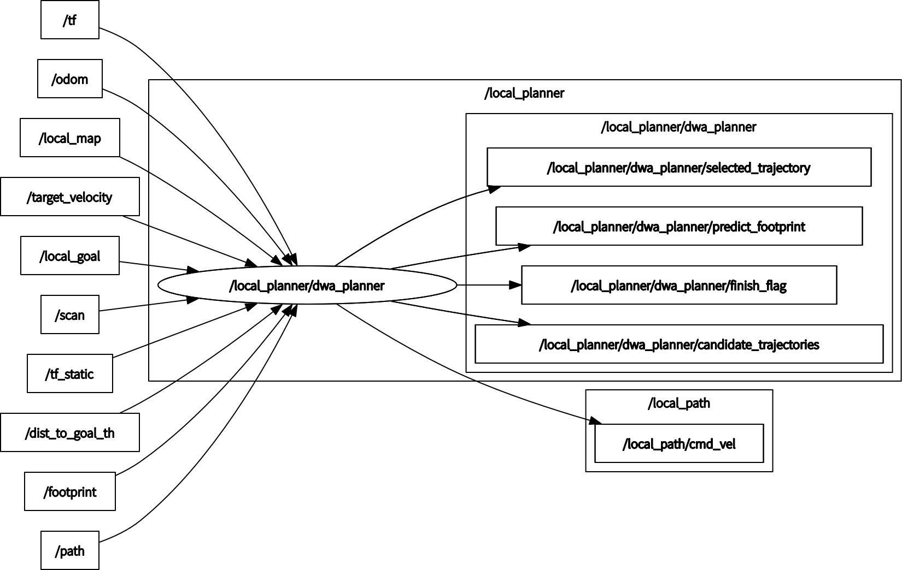

# dwa_planner

[](https://github.com/amslabtech/dwa_planner/actions)
[](https://github.com/amslabtech/dwa_planner/issues?q=is%3Aopen+is%3Aissue)
[](https://github.com/amslabtech/dwa_planner/issues?q=is%3Aissue+is%3Aclosed)


## Environment
- Ubuntu 20.04
- ROS Noetic

## Install and Build

```
cd catkin_workspace/src
git clone https://github.com/amslabtech/dwa_planner.git
cd dwa_planner
catkin build --this
```

## Node I/O


### Optional Topics
- /scan
  - Default input is /local_map
  - If /scan is used, set `use_scan_as_input` to true
- /footprint
  - robot footprint
  - If /footprint is used, set `use_footprint` to true
  - `footprint_publisher` node in `amsl_navigation_utils` repository publishes rectangular footprint
- /path
  - for path cost
  - Default evaluation does not use path cost
  - If path cost is used, set `use_path_cost` to true
    - Give a part of the global path (edge)

### Parameters
- HZ
  - main loop rate (default: 20[Hz])
- TARGET_VELOCITY
  - max velocity of robot's target velocity (default: 0.55[m/s])
- ROBOT_FRAME
  - robot's coordinate frame (default: base_link)

### Runtime requirement
- TF (from LocalMap_FRAME to ROBOT_FRAME) is required

## How to Use
- for local path planning
```
roslaunch dwa_planner local_planner.launch
```

## References
- D. Fox,  W. Burgard, and S.Thrun, "The dynamic window approach to collision avoidance", IEEE Robotics Automation Magazine, 1997.

(https://ieeexplore.ieee.org/abstract/document/580977)
