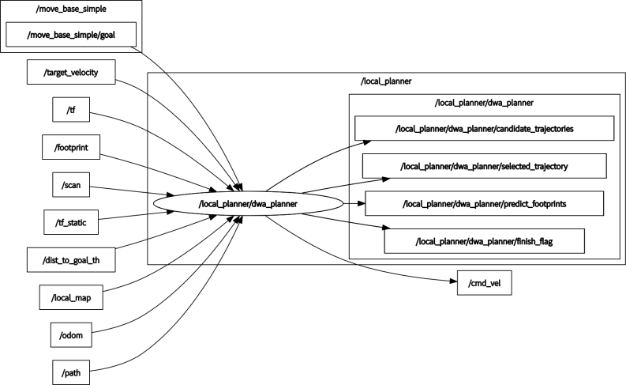

# dwa_planner

[](https://github.com/amslabtech/dwa_planner/actions)
[](https://github.com/amslabtech/dwa_planner/issues?q=is%3Aopen+is%3Aissue)
[](https://github.com/amslabtech/dwa_planner/issues?q=is%3Aissue+is%3Aclosed)

## Overview
ROS implementation of DWA(Dynamic Window Approach) Planner

The API documentation is available at [https://amslabtech.github.io/dwa_planner/](https://amslabtech.github.io/dwa_planner/)

**Note: This simulator is not provided.**


## Environment
- Ubuntu 20.04
- ROS Noetic

## Install and Build
```
# clone repository
cd /path/to/your/catkin_ws/src
git clone https://github.com/amslabtech/dwa_planner.git

# build
cd /path/to/your/catkin_ws
rosdep install -riy --from-paths src --rosdistro noetic # Install dependencies
catkin build dwa_planner -DCMAKE_BUILD_TYPE=Release     # Release build is recommended
```

## How to use
```
roslaunch dwa_planner local_planner.launch
```

## Running the demo with docker
```
git clone https://github.com/amslabtech/dwa_planner.git && cd dwa_planner

# build an image, create a container and start demo (Ctrl-c: stop a container and exit)
docker compose up
# remove a container
docker compose down
```

## Running the demo without docker
### Using simulator
```
# clone repository
cd /path/to/your/catkin_ws/src
git clone -b noetic-devel https://github.com/ROBOTIS-GIT/turtlebot3_msgs.git
git clone -b noetic-devel https://github.com/ROBOTIS-GIT/turtlebot3.git
git clone -b noetic-devel https://github.com/ROBOTIS-GIT/turtlebot3_simulations.git

# build
cd /path/to/your/catkin_ws
rosdep install -riy --from-paths src --rosdistro noetic
catkin build -DCMAKE_BUILD_TYPE=Release

# run demo
export TURTLEBOT3_MODEL=burger
roslaunch dwa_planner demo.launch
```


## Node I/O


### Published/Subscribed Topics
Access [here](docs/Topics.md)

### Runtime requirement
- TF (from GLOBAL_FRAME to ROBOT_FRAME) is required

## Parameters
Access [here](docs/Parameters.md)

## References
- [D. Fox,  W. Burgard, and S.Thrun, "The dynamic window approach to collision avoidance", IEEE Robotics Automation Magazine, 1997.](https://ieeexplore.ieee.org/abstract/document/580977)
